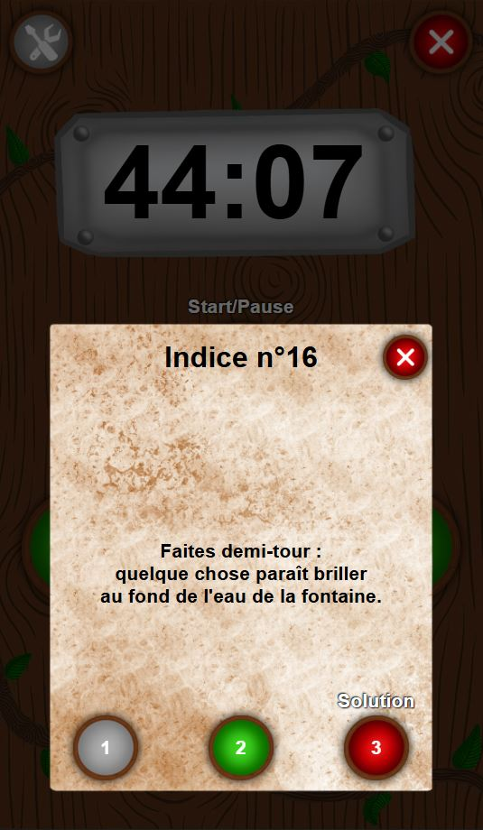
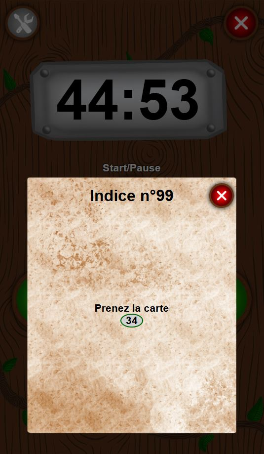

# Les indices

# Exemple basique

Dans votre `Scenario`, dans la méthode `load()`, vous pouvez par exemple utiliser :
```javascript
this.addHelp(new Help('99', "Test"))
```
Ce qui permettra aux joueurs d'obtenir l'indice *Test* en entrant le code **99**.

## Plusieurs niveaux (et Solution)

Il est possible d'ajouter plusieurs niveaux d'indices :
```javascript
this.addHelp(
    new Help('99', "Test")
        .addHelp("Ceci est le\n deuxième indice")
        .addHelp("Et voici la solution")
)
```

* Lorsqu'il y a plusieurs niveaux d'indices, le dernier niveau sera toujours considéré comme la solution.

* L'indice courant est affiché en vert, et la solution est toujours affichée en rouge.



## Tokens

Il est possible d'ajouter des "tokens" dans vos textes, qui seront interprétés par le jeu pour afficher le texte différemment.
Par exemple,
```javascript
new Help('99', "Prenez la carte #CARD_ADD[34]")
```
donnera :



Pour plus d'informations, voir [Message tokens](./message_tokens.md)

## Notes

* Utiliser des indices, ou la solution, est comptabilisé en fin de partie (comme sur la vraie application Unlock).
* Il n'y a *a priori* pas de limite au nombre d'indices pour une carte donnée. Les scénarios officiels d'Unlock se limitent à 3 maximum.
* Si les joueurs entrent un numéro d'indice qui n'existe pas dans le scénario, le jeu affiche simplement "Rien à signaler..."