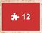
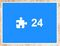

# Message Tokens

Dans n'importe quelle fenêtre qui affiche du texte, il vous est possible d'utiliser les tokens suivants :

## #ICON[any]
On utilise [FontAwesome](https://fontawesome.com/search) pour les icônes.

Exemple : `C #ICON[fa-solid fa-right-long] A` donne :

## #PUZZLE_RED[any]
Exemple : `#PUZZLE_RED[12]` donne :

## #PUZZLE_BLUE[any]
Exemple : `#PUZZLE_BLUE[24]` donne :

## #CARD[any]
Exemple : `#CARD[18]` donne :

## #CARD_DEL[any]
Exemple : `#CARD_DEL[18]` donne :

## #CARD_ADD[any]
Exemple : `#CARD_ADD[18]` donne :

